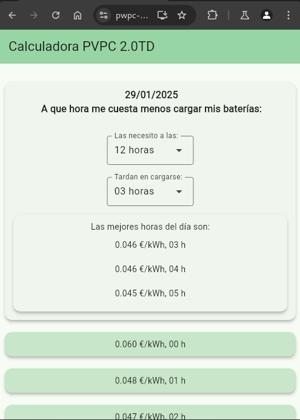

# Precio Elec App

## Descripción
pwpc-flutter es una aplicación desarrollada en Flutter que permite a los usuarios consultar los precios de la electricidad.

## Captura de Pantalla


## Instalación
Para instalar y ejecutar la aplicación localmente, sigue estos pasos:

1. Clona el repositorio:
    ```bash
    git clone https://github.com/lytsistemas/pwpc-flutter-app.git
    ```
2. Navega al directorio del proyecto:
    ```bash
    cd pwpc-flutter-app
    ```
3. Instala las dependencias:
    ```bash
    flutter pub get
    ```
4. Ejecuta la aplicación:
    ```bash
    flutter run
    ```

## Licencia
Este proyecto está licenciado bajo la Licencia MIT. Consulta el archivo `LICENSE` para más detalles.


